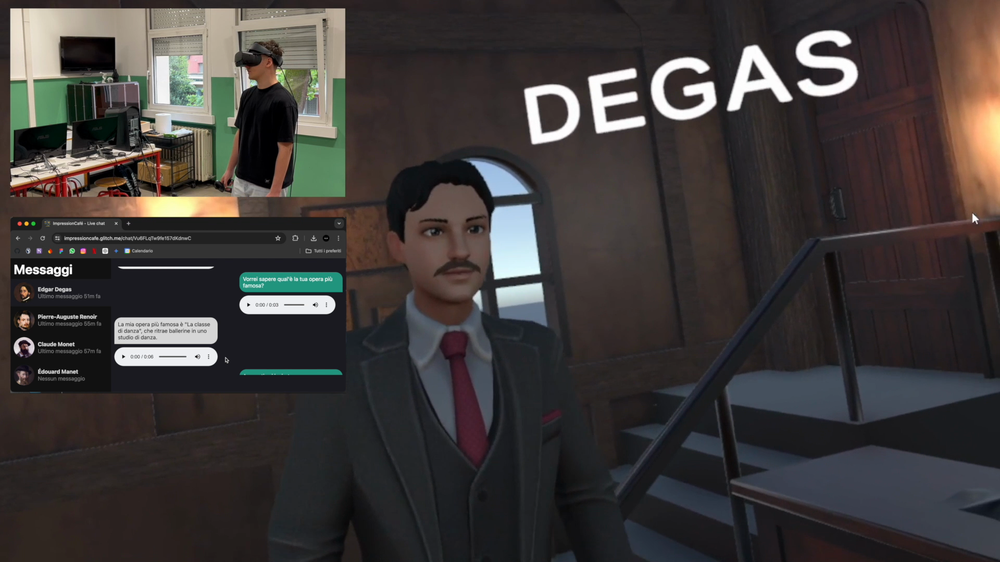
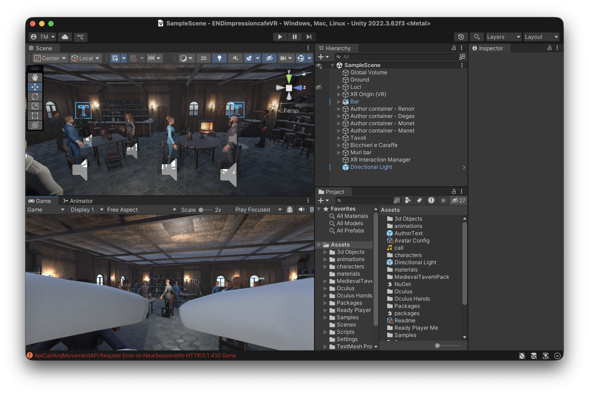
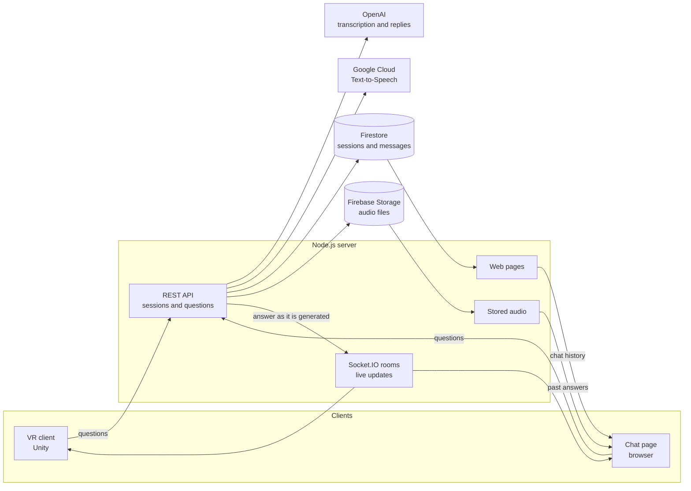

# ImpressionCafé

A VR reconstruction of the Café Guerbois where students talk out loud with four Impressionist painters, each played by an AI chatbot.

[](LICENSE)


[](https://drive.google.com/file/d/1PR18X5HgczpVtX4VEUkz5tyVjIF7tvHU/view)

**Demo video:** https://drive.google.com/file/d/1PR18X5HgczpVtX4VEUkz5tyVjIF7tvHU/view

<!-- portfolio:summary
## The problem
My art history teacher asked for an interactive reconstruction of the Café Guerbois, where the Impressionist painters used to meet, so that students could talk with them instead of only reading about them. I teamed up again with Ivan Lomaka and, drawing on our Cappella degli Scrovegni 360° project, we brought together AI chatbots, VR headsets and art history to build it.

## The solution
A VR café with Monet, Renoir, Degas and Manet: you walk up to one, ask a question out loud and he answers by voice, in character. A web page follows every conversation live and, without a headset, works as a simple chat with the painters. I built the server and the web pages, Ivan built the VR client, Andrea Luca Bristot modelled the café.

## Technical challenges
- Waiting for the whole reply before turning it into speech was too slow, so I stream it and send each sentence to text-to-speech while the model is still writing.
- Speech clips can come back out of order, so each one carries an index and the clients play them in sequence.
- One Socket.IO room per session feeds both the headset and any browser watching.

## What I learned
- Working in a team with a sharp split: the server was mine, Unity was Ivan's.
- Building a system whose parts live in separate environments, talk over an API and WebSockets and serve different kinds of clients at once.
- Working with the OpenAI APIs (chat models and Whisper) and Google Cloud Text-to-Speech.
- Treating response time as a requirement, not only whether the system works.

## Stack
Node.js, Express, Socket.IO, OpenAI API (Whisper, GPT-3.5), Google Cloud Text-to-Speech, Firebase (Firestore, Storage), Unity, C#

## Recognition
- TV report on Antenna Tre, 9 June 2024 ([watch](https://antennatre.medianordest.it/116968/treviso-didattica-interattiva-al-duca-degli-abruzzi-si-studia-nel-metaverso/)).
- "Il Metaverso del Café Guerbois", my teacher's post on Repubblica Scuola ([read](https://scuola.repubblica.it/post/64333/teacher/show)).
-->

<!-- portfolio:start -->
## The problem
Prof. Cristina Tranchese, my art history teacher at Liceo Duca degli Abruzzi in Treviso, asked us for one last project in our final year: an interactive reconstruction of the Café Guerbois, the café where the Impressionist painters used to meet, so that students could talk with the painters instead of only reading about them.

So I teamed up again with [@IvanLomaka](https://github.com/ivanlomaka). Drawing on what we had learned building the [Cappella degli Scrovegni 360°](https://github.com/tommasomoro8/cappella-degli-scrovegni), we brought together AI chatbots, 3D with VR headsets and art history, and created ImpressionCafé.

## The solution
You put on the headset and you are standing in the café. Four painters are there: Claude Monet, Pierre-Auguste Renoir, Edgar Degas and Édouard Manet. When you walk up to one, he turns towards you. You hold the controller trigger, ask your question out loud and release. He answers by voice, in character.

Each painter is told to speak in the first person, to keep answers very short, and to say he can't answer when the question has nothing to do with his life and work.

Everyone else can follow on a web page. Every session has a chat page that shows, live, the transcribed question, the answer while it is being written and the audio of both. Without a headset, the same page also works as a simple chat: opened directly from the website, it lets you type or record a question to a painter and read and hear his answer, with no 3D café around you.

The project is also a base for similar experiences with other artists or famous people. On the server a character is one entry in a list, with a voice and a system prompt.

I built the server and the web pages, Ivan built the VR client in Unity, Andrea Luca Bristot modelled the café.



## From input to output
This exchange is the one in the demo video.

1. In the headset, the user holds the trigger next to Degas and asks which of his works is the most famous.
2. Unity sends the recording to `POST /api/<sessionId>/new-chat/chat-degas`.
3. Whisper transcribes it. The chat page shows the question and its audio: *"Vorrei sapere qual'è la tua opera più famosa?"*
4. `gpt-3.5-turbo` writes the reply in character, and the chat page shows it while it is written: *"La mia opera più famosa è "La classe di danza", che ritrae ballerine in uno studio di danza."*
5. Text-to-Speech turns each sentence into an MP3 clip. Degas says it in the headset and the chat page plays it.

## Technical challenges
- **Getting the painter to start talking sooner.** One question goes through three slow steps: transcription, text generation and speech synthesis. At first I waited for the model to finish the whole reply, turned it into audio and only then sent it to the clients. The painter took too many seconds to answer and the conversation felt slow. So I switched to the streaming mode of the OpenAI chat API: I cut the reply at every `.`, `!` or `?` and send each sentence to Text-to-Speech at once. The first sentence reaches the clients over Socket.IO while the model is still writing, and by the time it has been played the next one is most likely ready.
- **Keeping the audio in order.** The Text-to-Speech calls run in parallel and can finish in any order. Each clip carries an `audioOrder` index, and the clients play the clips in sequence. When every clip is back, the server joins them into one MP3 and stores it, so the answer can be played again when the page is reopened.
- **Two very different clients on one stream.** The browser and Unity both join a Socket.IO room named after the session. The browser gets each clip as binary data on the `chat` event. Unity gets the same clip as a base64 string on a separate `chat-unity` event.

## What I learned
- This was a really broad project. It taught me to work in a team with a sharp split of the parts: the server was mine, the Unity client was Ivan's.
- How to build a more complex system whose parts live in separate environments, talk over an API and WebSockets, and serve different kinds of clients at the same time: a VR headset and any number of browsers.
- How to work with external AI services: the OpenAI chat models and Whisper for speech recognition, and Google Cloud Text-to-Speech.
- To treat time as a requirement, alongside correctness. It was not enough for the painter to give the right answer: he had to answer fast enough for it to feel like a real conversation.

## Stack
- **Server:** Node.js, Express, Socket.IO, Multer, Helmet, express-rate-limit, dotenv
- **AI services:** OpenAI API (`whisper-1` and `gpt-3.5-turbo`), Google Cloud Text-to-Speech
- **Data:** Firebase (Firestore, Cloud Storage) through firebase-admin
- **Web pages:** HTML, CSS, JavaScript, the Socket.IO client, the MediaRecorder API
- **VR client:** Unity 2022.3 (URP), C#, OpenXR, XR Interaction Toolkit, SocketIOUnity, Ready Player Me avatars, Oculus LipSync
- **Hosting:** Glitch (original deploy, now offline)

## Recognition
- ["Didattica interattiva: al Duca degli Abruzzi si studia nel metaverso"](https://antennatre.medianordest.it/116968/treviso-didattica-interattiva-al-duca-degli-abruzzi-si-studia-nel-metaverso/), a TV report on Antenna Tre with interviews with me, Ivan and our teachers (9 June 2024).
- ["Il Metaverso del Café Guerbois"](https://scuola.repubblica.it/post/64333/teacher/show), a post by Prof. Tranchese on Repubblica Scuola (14 February 2025).
<!-- portfolio:end -->

## Architecture



- **REST for actions, WebSockets for live updates.** Clients create sessions and send questions through the REST API. Everything that happens while a painter answers (the transcript, the text as it is written, the audio clips) is pushed through the Socket.IO room of the session to every client watching it.
- **The server orchestrates, external services do the AI work.** OpenAI transcribes the question and writes the reply, Google Cloud turns it into speech. The server chains them and streams the result.
- **A session is the shared unit.** A session holds one conversation per painter in Firestore, with its audio in Firebase Storage. The headset and any number of browsers can follow the same session.
- **Characters are data.** Each painter is one entry in a list on the server, with a name, a voice and a system prompt.
- **No build step.** The web pages are rendered by Express with plain HTML, CSS and JavaScript.
- **Cleaning up.** A session is created every time the Unity scene starts, even if nobody then asks anything, so the server periodically deletes the sessions that stayed empty.

## Running locally

### Server

You need Node.js (`package.json` asks for Node 18), an OpenAI API key, a Google Cloud service account with Text-to-Speech enabled, and a Firebase project with Firestore and Storage. The server does not start without them.

```bash
git clone https://github.com/tommasomoro8/impression-cafe.git
cd impression-cafe/src/server
npm install
cp .env.example .env    # fill in your keys and service accounts
npm start               # http://localhost:3000
```

Keep `NODE_ENV="development"` in `.env` when you run it locally: with any other value every request is redirected to HTTPS.

Open `http://localhost:3000`, click "Nuova chat" and you get a chat page where you can type or record a question. `http://localhost:3000/en` starts an English session.

### VR client

Open `src/unityVR` with Unity 2022.3.62f3 from Unity Hub. Git must be installed, because Unity downloads the SocketIOUnity package from GitHub.

The server address is the `Domain` field of the `ApiCallAndMovement` component in `Assets/Scenes/SampleScene.unity`. It defaults to `http://localhost:3000`, without the final slash.

<!-- TODO: how the headset is connected and how the scene is started -->

There are no automated tests.

## Repository structure
```
impression-cafe/
├── src/
│   ├── server/                  ← the Node.js server and the web pages (my part)
│   │   ├── server.js            ← entry point: Express, Socket.IO, middleware
│   │   ├── routes/
│   │   │   ├── api.js           ← new session and the whole question-to-answer turn
│   │   │   ├── chat.js          ← chat page with its history, and the Socket.IO rooms
│   │   │   └── audio.js         ← redirects to a stored audio clip
│   │   ├── services/            ← OpenAI and Firebase clients
│   │   ├── middleware/          ← HTTPS redirect and trailing-slash cleanup
│   │   ├── views/               ← landing and chat pages as template strings
│   │   ├── static/              ← CSS, browser JavaScript, images and logo
│   │   ├── audio/               ← temporary audio files while a turn is processed
│   │   ├── .env.example         ← every variable, with placeholder values
│   │   └── package.json
│   └── unityVR/                 ← the Unity project of the VR client (Ivan's part)
│       ├── Assets/
│       │   ├── Scenes/          ← SampleScene, the café
│       │   ├── Scripts/         ← recording, API calls, audio playback, animations
│       │   ├── 3d Objects/      ← the café, tables, chairs and ornaments
│       │   ├── characters/      ← the four painters as prefabs
│       │   └── ...              ← avatars, animations and third-party plugins
│       ├── Packages/            ← package list and two embedded packages
│       └── ProjectSettings/
├── docs/screenshots/            ← images used in this README
├── README.md
├── LICENSE                      ← MIT, for the server only
└── portfolio.yml                ← metadata for my portfolio
```

## Known limitations and future work

**Limitations**
- **No live demo.** The Glitch deploy is offline. Running the project needs a VR headset, an OpenAI key, Google Cloud Text-to-Speech and a Firebase project, and the server does not start without all of them.
- **One long handler for a whole turn.** Transcription, reply, speech and saving live in a single route with little error handling, so some failures leave a session blocked until the server restarts. The lock that stops two questions at once lives in memory, so the server cannot run on more than one instance.
- **Short memory.** Only a fixed slice of the history reaches the model, and it is the oldest one: after a few exchanges the painter no longer sees what was said most recently.
- **Characters live in the code.** Adding a painter means editing the server and deploying it again.

**Future work**
- **Move the characters out of the code.** I would store painters, voices and prompts in Firestore. A teacher could then add a new historical figure without touching the server, which is what the project was meant to be a base for.
- **Create the session at the first question.** Today a session is opened as soon as the scene starts, and most of them stay empty until the clean-up deletes them. Creating it with the first question would avoid that work entirely.
- **Cleaner, more modular code.** Today the logic sits in a few very long files: the file with the whole question-to-answer turn is over 500 lines, and the chat page script almost 600. I would split them into small modules (transcription, reply, speech, storage) that are easier to read, test and change.

## Credits and license
- **Tommaso Moro:** server, API and web pages (landing and live chat).
- **Ivan Lomaka:** VR client in Unity.
- **Andrea Luca Bristot:** 3D model of the café.
- **Prof. Cristina Tranchese:** art history teacher, she proposed the project and supervised it.

The server and the web pages in `src/server/` are released under the [MIT License](LICENSE). The Unity project in `src/unityVR/` is excluded: the VR client belongs to Ivan Lomaka, the 3D model of the café to Andrea Luca Bristot, and the third-party packages keep their own licenses.

---

Created by Tommaso Moro and Ivan Lomaka in May 2024.
