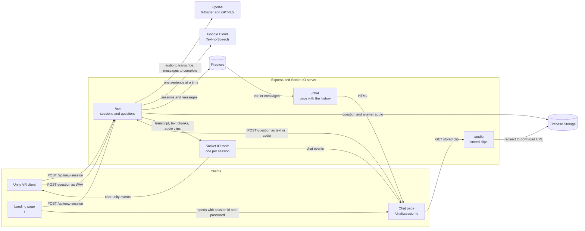

# ImpressionCafé

A VR reconstruction of the Café Guerbois where students talk out loud with four Impressionist painters, each played by an AI chatbot.

<!-- TODO: licence badge, once the licence is chosen -->


[](https://drive.google.com/file/d/1PR18X5HgczpVtX4VEUkz5tyVjIF7tvHU/view)

**Demo video:** https://drive.google.com/file/d/1PR18X5HgczpVtX4VEUkz5tyVjIF7tvHU/view

<!-- portfolio:summary
## The problem
My art history teacher asked for a final-year project mixing AI chatbots, VR headsets and art history: rebuild the Café Guerbois, where the Impressionists met, and let students talk with the painters.

## The solution
A VR café with Monet, Renoir, Degas and Manet: you walk up to one, ask a question out loud and he answers by voice. A web page shows every conversation live. I built the server and the web pages; Ivan Lomaka built the VR client.

## Technical challenges
- I send each sentence to text-to-speech while the model is still writing, so the painter starts talking sooner.
- Speech clips can come back out of order, so each one carries an index and the clients play them in sequence.
- One Socket.IO room per session feeds both the headset and any browser watching.

## What I learned
- Working in a team with a sharp split: the server was mine, Unity was Ivan's.
- Building a system whose parts live in separate environments and talk over an API and WebSockets.

## Stack
Node.js, Express, Socket.IO, OpenAI API (Whisper, GPT-3.5), Google Cloud Text-to-Speech, Firebase (Firestore, Storage), Unity, C#

## Recognition
- TV report on Antenna Tre, 9 June 2024 ([watch](https://antennatre.medianordest.it/116968/treviso-didattica-interattiva-al-duca-degli-abruzzi-si-studia-nel-metaverso/)).
- "Il Metaverso del Café Guerbois", my teacher's post on Repubblica Scuola ([read](https://scuola.repubblica.it/post/64333/teacher/show)).
-->

<!-- portfolio:start -->
## The problem
Prof. Cristina Tranchese, my art history teacher at Liceo Duca degli Abruzzi in Treviso, asked for one last project in our final year. It had to bring together three things: AI chatbots, 3D with VR headsets, and art history.

The idea was to rebuild the Café Guerbois, the café where the Impressionist painters used to meet, and to let students talk with the painters instead of only reading about them.

I worked on it with [@IvanLomaka](https://github.com/ivanlomaka), the same team-mate and the same teacher as the [Cappella degli Scrovegni 360°](https://github.com/tommasomoro8/cappella-degli-scrovegni) project.

## The solution
You put on the headset and you are standing in the café. Four painters are there: Claude Monet, Pierre-Auguste Renoir, Edgar Degas and Édouard Manet. When you walk up to one, he turns towards you. You hold the controller trigger, ask your question out loud and release. He answers by voice, in character.

Each painter is told to speak in the first person, to keep answers very short, and to say he can't answer when the question has nothing to do with his life and work.

Everyone else can follow on a web page. Every session has a chat page that shows, live, the transcribed question, the answer while it is being written and the audio of both. The same page also works without a headset: opened with the session password, it lets you type or record a question.

The project is also a base for similar experiences with other artists or famous people. On the server a character is one entry in a list, with a voice and a system prompt.

I built the server and the web pages. Ivan built the VR client in Unity. Andrea Luca Bristot modelled the café.


## From input to output
This exchange is the one in the demo video.

1. In the headset, the user holds the trigger next to Degas and asks which of his works is the most famous.
2. Unity sends the recording to `POST /api/<sessionId>/new-chat/chat-degas`.
3. Whisper transcribes it. The chat page shows the question and its audio: *"Vorrei sapere qual'è la tua opera più famosa?"*
4. `gpt-3.5-turbo` writes the reply in character, and the chat page shows it while it is written: *"La mia opera più famosa è "La classe di danza", che ritrae ballerine in uno studio di danza."*
5. Text-to-Speech turns each sentence into an MP3 clip. Degas says it in the headset and the chat page plays it.

## Technical challenges
- **Getting the painter to start talking sooner.** One question goes through three slow steps: transcription, text generation and speech synthesis. I stream the reply from the model and cut it at every `.`, `!` or `?`. Each sentence goes to Text-to-Speech at once, while the model keeps writing the next one.
- **Keeping the audio in order.** The Text-to-Speech calls run in parallel and can finish in any order. Each clip carries an `audioOrder` index, and the clients play the clips in sequence. When every clip is back, the server joins them into one MP3 and stores it, so the answer can be played again when the page is reopened.
- **Two very different clients on one stream.** The browser and Unity both join a Socket.IO room named after the session. The browser gets each clip as binary data on the `chat` event. Unity gets the same clip as a base64 string on a separate `chat-unity` event.
- **Who can talk and who can only watch.** Creating a session returns a random 30-character write password. A question is accepted only with that password in a header; without it, the chat page is read-only. A lock per session rejects a second question while the first one is still being answered.

## What I learned
- This was a really broad project. It taught me to work in a team with a sharp split of the parts: the server was mine, the Unity client was Ivan's.
- How to build a more complex system whose parts live in separate environments and talk over an API and WebSockets. The website shows in real time the chat and the audio captured through the headset.

## Stack
- **Server:** Node.js, Express, Socket.IO, Multer, Helmet, express-rate-limit, dotenv
- **AI services:** OpenAI API (`whisper-1` and `gpt-3.5-turbo`), Google Cloud Text-to-Speech
- **Data:** Firebase (Firestore, Cloud Storage) through firebase-admin
- **Web pages:** HTML, CSS, JavaScript, the Socket.IO client, the MediaRecorder API
- **VR client:** Unity 2022.3 (URP), C#, OpenXR, XR Interaction Toolkit, SocketIOUnity, Ready Player Me avatars, Oculus LipSync
- **Hosting:** Glitch (original deploy, now offline)

## Recognition
- ["Didattica interattiva: al Duca degli Abruzzi si studia nel metaverso"](https://antennatre.medianordest.it/116968/treviso-didattica-interattiva-al-duca-degli-abruzzi-si-studia-nel-metaverso/), a TV report on Antenna Tre with interviews with me, Ivan and our teachers (9 June 2024).
- ["Il Metaverso del Café Guerbois"](https://scuola.repubblica.it/post/64333/teacher/show), a post by Prof. Tranchese on Repubblica Scuola (14 February 2025).
<!-- portfolio:end -->

## Architecture



- **One request per turn.** `POST /api/:sessionId/new-chat/:authorId` does the whole turn: checks, transcription, reply, speech, saving. Its HTTP response arrives only at the end. Everything the user sees or hears before that travels on Socket.IO.
- **A session is a Firestore document.** Under it there is one collection per painter, with the system prompt, the questions and the answers in order. The audio files sit in Storage under `sessions/<sessionId>/`.
- **Characters are data.** `routes/api.js` keeps a list with each painter's id, voice, pitch and system prompt. The prompts come from environment variables.
- **Pages without a framework.** The landing and the chat page are template strings rendered by Express, with plain CSS and JavaScript in `static/`. There is no build step.
- **Temporary files.** Uploaded and generated audio is written to `audio/`, uploaded to Storage and then deleted from disk.
- **Cleaning up.** A session that still has no messages one hour after it was created is deleted. The check runs every 30 minutes.

## Running locally

### Server

You need Node.js (`package.json` asks for Node 18), an OpenAI API key, a Google Cloud service account with Text-to-Speech enabled, and a Firebase project with Firestore and Storage. The server does not start without them.

```bash
git clone https://github.com/tommasomoro8/impression-cafe.git
cd impression-cafe/src/server
npm install
cp .env.example .env    # fill in your keys and service accounts
npm start               # http://localhost:3000
```

Keep `NODE_ENV="development"` in `.env` when you run it locally: with any other value every request is redirected to HTTPS.

Open `http://localhost:3000`, click "Nuova chat" and you get a chat page where you can type or record a question. `http://localhost:3000/en` starts an English session.

### VR client

Open `src/unityVR` with Unity 2022.3.62f3 from Unity Hub. Git must be installed, because Unity downloads the SocketIOUnity package from GitHub.

The server address is the `Domain` field of the `ApiCallAndMovement` component in `Assets/Scenes/SampleScene.unity`. It defaults to `http://localhost:3000`, without the final slash.

<!-- TODO: how the headset is connected and how the scene is started -->

There are no automated tests.

## Repository structure
```
impression-cafe/
├── src/
│   ├── server/                  ← the Node.js server and the web pages (my part)
│   │   ├── server.js            ← entry point: Express, Socket.IO, middleware
│   │   ├── routes/
│   │   │   ├── api.js           ← new session and the whole question-to-answer turn
│   │   │   ├── chat.js          ← chat page with its history, and the Socket.IO rooms
│   │   │   └── audio.js         ← redirects to a stored audio clip
│   │   ├── services/            ← OpenAI and Firebase clients
│   │   ├── middleware/          ← HTTPS redirect and trailing-slash cleanup
│   │   ├── views/               ← landing and chat pages as template strings
│   │   ├── static/              ← CSS, browser JavaScript, images and logo
│   │   ├── audio/               ← temporary audio files while a turn is processed
│   │   ├── .env.example         ← every variable, with placeholder values
│   │   └── package.json
│   └── unityVR/                 ← the Unity project of the VR client (Ivan's part)
│       ├── Assets/
│       │   ├── Scenes/          ← SampleScene, the café
│       │   ├── Scripts/         ← recording, API calls, audio playback, animations
│       │   ├── 3d Objects/      ← the café, tables, chairs and ornaments
│       │   ├── characters/      ← the four painters as prefabs
│       │   └── ...              ← avatars, animations and third-party plugins
│       ├── Packages/            ← package list and two embedded packages
│       └── ProjectSettings/
├── docs/screenshots/            ← images used in this README
├── README.md
└── portfolio.yml                ← metadata for my portfolio
```

## Known limitations and future work

**Limitations**
- There is no live demo. The Glitch deploy is offline, and running it needs a VR headset and paid AI services.
- The server does not start without every credential. With credentials that Firebase rejects, it starts and then crashes at the first database call.
- English sessions get English transcription and an English voice, but the painter still receives the Italian system prompt: `systemContentEn` is defined and never read.
- The painter's memory stops growing. The history query takes the first 10 messages of the chat instead of the last 10, so after five exchanges the model no longer sees the most recent ones.
- If reading the history fails, the handler answers 500 and keeps running. It then throws, and the session stays locked until the server restarts.
- The lock that blocks two questions at once lives in memory, so it only works with a single server instance.
- On the landing page the "Assisti a una chat" button does nothing, the credits still contain placeholder text, and only one button is translated in the English version.
- The write password travels in the page URL and is generated with `Math.random()`.
- `trust proxy` is set to `true`, so the rate limit can be bypassed with a forged `X-Forwarded-For` header.
- In the VR client the session id only appears in the Unity console, so a spectator cannot easily find the chat page of a running session.
- In the VR client, when speech clips arrive out of order, one can be played twice and another skipped.

**Future work**
<!-- TODO: Tommaso to confirm or replace these points -->
- **Fix the memory.** I would read the last messages in descending order and always put the system prompt first, taken from the configuration instead of from the database. The painter would remember the recent turns, and a prompt change would also reach old sessions.
- **Finish the English version.** I would pick `systemContentEn` when the session language is English and translate the landing page, so that an English session is English from start to end.
- **Release the lock in every case.** I would wrap the turn in `try`/`finally` so that an error can never leave a session blocked.
- **Make "watch a chat" real.** I would show a short session code inside the headset and add a field for it on the landing page. Today a spectator needs the full URL.
- **Move the characters out of the code.** I would store painters, voices and prompts in Firestore. A teacher could then add a new historical figure without touching the server, which is what the project was meant to be a base for.

## Credits and license
- **Tommaso Moro:** server, API and web pages (landing and live chat).
- **Ivan Lomaka ([@IvanLomaka](https://github.com/ivanlomaka)):** VR client in Unity.
- **Andrea Luca Bristot:** 3D model of the café.
- **Prof. Cristina Tranchese:** art history teacher, she proposed the project and supervised it.
- Avatars: [Ready Player Me](https://readyplayer.me/).
- Unity packages and plugins: [SocketIOUnity](https://github.com/itisnajim/SocketIOUnity), [glTFast](https://github.com/atteneder/glTFast), [Ready Player Me Core SDK](https://github.com/readyplayerme/rpm-unity-sdk-core), Oculus LipSync, XR Interaction Toolkit, TextMesh Pro.
- Server libraries: [Express](https://expressjs.com/), [Socket.IO](https://socket.io/), [Multer](https://github.com/expressjs/multer), [Helmet](https://helmetjs.github.io/), [express-rate-limit](https://github.com/express-rate-limit/express-rate-limit), [openai](https://github.com/openai/openai-node), [@google-cloud/text-to-speech](https://github.com/googleapis/google-cloud-node), [firebase-admin](https://firebase.google.com/docs/admin/setup).

<!-- TODO: licence sentence and LICENSE file, once the licence is chosen -->

---

Created by Tommaso Moro and Ivan Lomaka in 2024.
<!-- TODO: add the month in which the project ended -->
